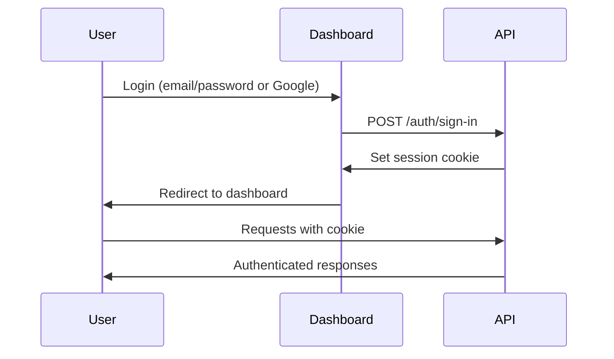

# Authentication

The Elys API uses **session-based authentication** powered by [BetterAuth](https://better-auth.com).

## How it Works

<Steps>
  <Step title="Sign In">
    Authenticate via email/password or Google OAuth through the dashboard
  </Step>
  <Step title="Session Cookie">
    A session cookie (`better-auth.session_token`) is set automatically
  </Step>
  <Step title="Make Requests">
    Include the cookie with all API requests (automatic in browsers)
  </Step>
</Steps>

## Authentication Flow



## Session Cookie

All authenticated requests require the session cookie:

```
Cookie: better-auth.session_token=<session_token>
```

<Note>
  When using the API from a browser, cookies are sent automatically.
  For server-to-server requests, you'll need to manage the cookie manually.
</Note>

## Getting the Current User

After authentication, get the current user's info:

```bash
curl http://localhost:3000/api/users/me \
  -H "Cookie: better-auth.session_token=YOUR_SESSION_TOKEN"
```

**Response:**
```json
{
  "data": {
    "id": "user_123",
    "email": "creator@example.com",
    "name": "Luna",
    "role": "MODEL",
    "modelId": "model_456"
  }
}
```

## User Roles

| Role | Description | Access |
|------|-------------|--------|
| `MANAGER` | Agency/manager account | Full access to all models they manage |
| `MODEL` | Content creator account | Access only to their own model data |

## Sign Out

To end a session:

```bash
curl -X POST http://localhost:3000/auth/sign-out \
  -H "Cookie: better-auth.session_token=YOUR_SESSION_TOKEN"
```

## Error Responses

### 401 Unauthorized

Returned when no valid session is provided:

```json
{
  "error": {
    "message": "Unauthorized",
    "statusCode": 401
  }
}
```

### 403 Forbidden

Returned when the user doesn't have permission:

```json
{
  "error": {
    "message": "Access denied to this model",
    "statusCode": 403
  }
}
```
